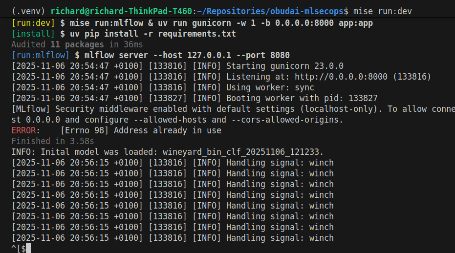
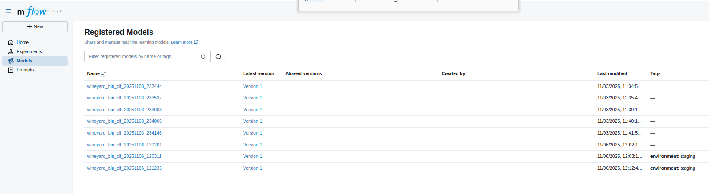
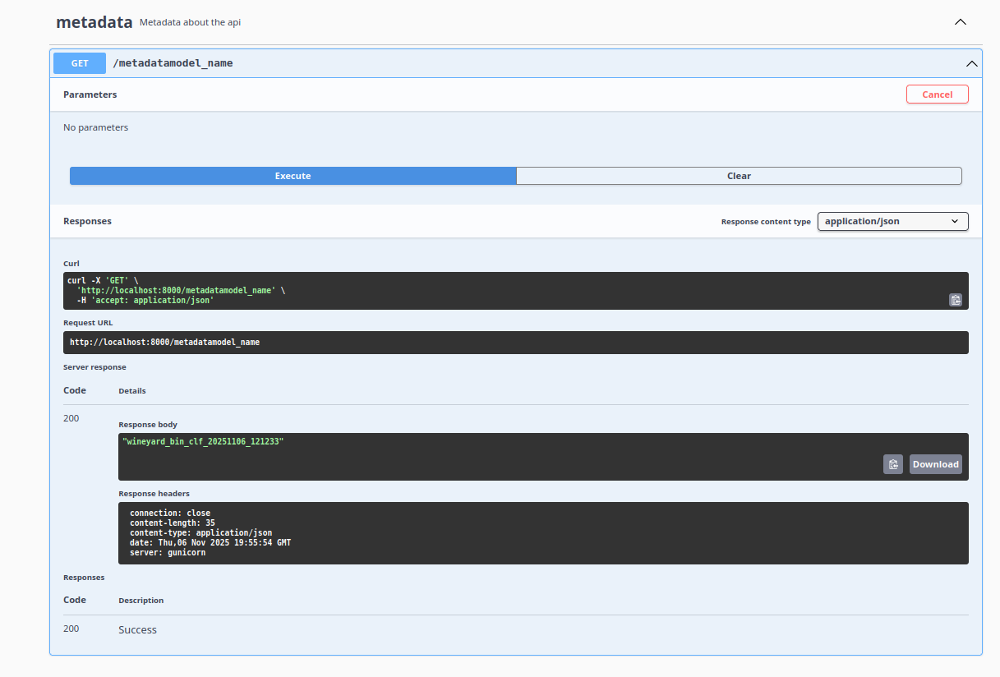
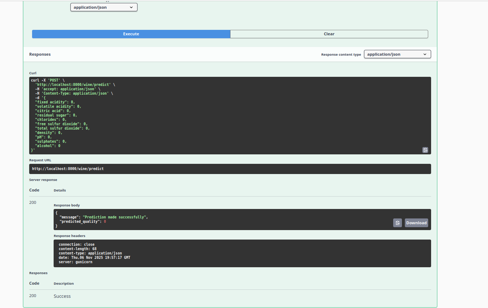
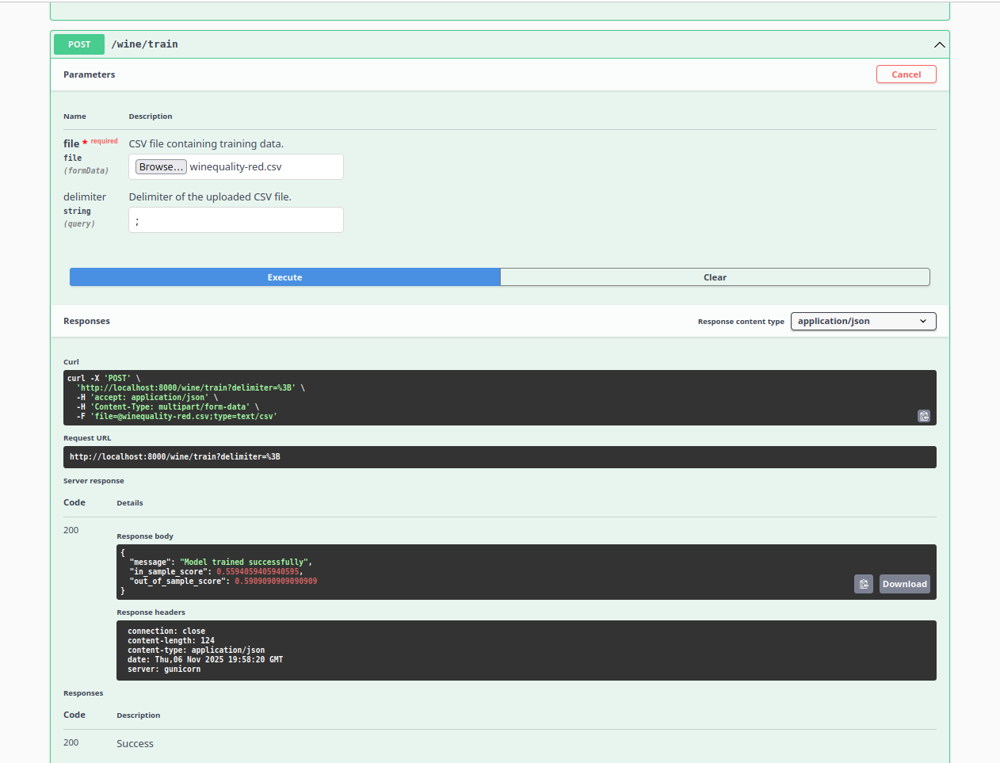
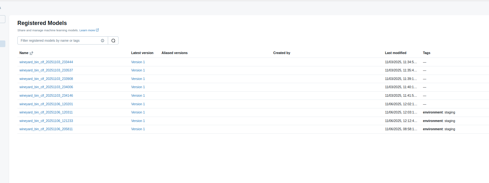

## 5. heti hazifeladat bemutato

A hazifeladat celja az MLFlow felhasznalasa volt a mar meglevo ML API-nk segitsegevel. 

A hazifeladatomban a kovetkezo funkcionalitast implementaltam:
1. Minden train endpoint hivasra a model automatikusan elmentodik MLFLflow-ban. 
    Es megkapja az `environment: staging` tag-et.
2. Az API elinditasakor a legutolso staging model betoltodik az MLFlow-bol es hasznalhatova valik az API-n keresztul.

Ezt a funkcionalitast a mar meglevo `ml_model.MLModel` classomat wrappelve hoztam letre az `ml_model_mlflow.py` file-ban. 
Ez az uj funkcionalitas nem kapott automata test-eket, mert meg csak baratkozom az MLFlow API-javal.

### Walkthrough

Mar elozoleg futattam a szervert es train-eltem vele. 
Igy a mar meglevo stagin model betoltodik server inditaskor.
Erre hivja fel a figyelmet az INFO logline (amelyik nem a servertol jon annotaciokkal, hanem az INFO a sor legeljen talalhato).

Az MLFlow UI-on gyozodjunk meg rola, hogy valoban letezik mar az INFO logline altal emlitett model (`wineyard_bin_clf_20251106_121233`), es az valoban a legujabb staging modellunk!

Implementaltam egy uj API endpointot annak erdekeben, hogy a mindenkor az API altal kiszolgalt ml model neve lekerdezhetove valjek. 
Hasznaljuk ezt, annak erdekeben, hogy double-checkoljuk, hogy a regi model betoltodott-e!

A puding probaja az eves, hasznaljuk ezt a regi modelt predikciora!

Vegul gyozodjunk meg arrol, hogy:
1. az API-nk nem romlott el. Uj model meg mindig train-elhetom

2. es ez az uj model megjelenik az MLFlow UI-on a megfelelo taggel!

### Megjegyzesek
- Ahogy emlitettem, az uj funkcionalitas nincs letesztelve.
- Ha tobb modelt track-elnenk az MLFlow-val akkor ugyesebben kene tag-elni (a jelen kod minden model kozul kivalasztja az utolso staging-et).
- Az `MLModel` wrappelese szebb lenne, ha definialnank egy interface-t (amit az API hasznal es elvar), es ezt mind az eredeti `ml_model.MLModel` class es az uj `ml_model_mlflow.MLModelWithMLFlow `class implementalna (vagy ha decorator pattert hasznalnank).
- A kepek idealis esetben git lfs-be kene menjenek. 
    Nem tettem igy, mert az egesz csak 0.5 mega nagysagu.
