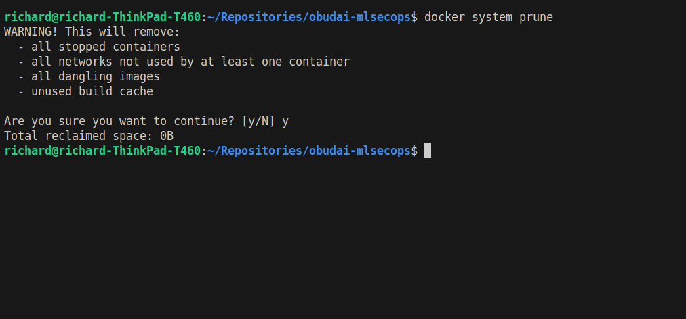
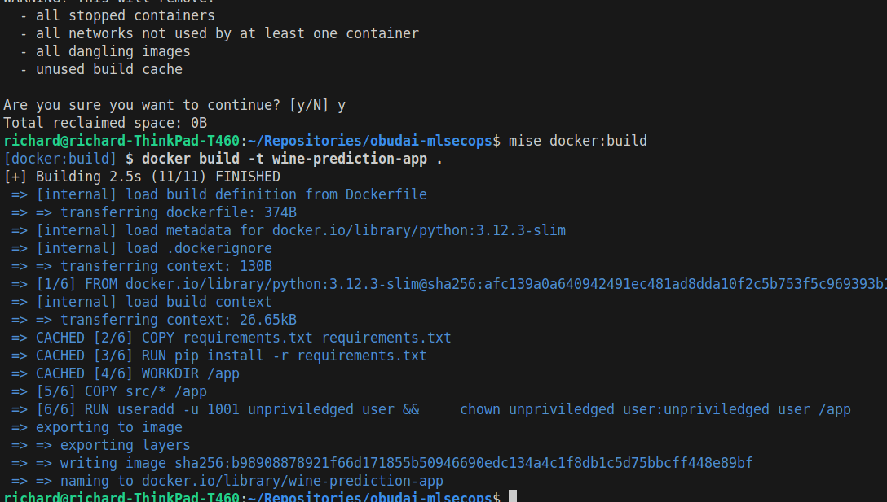
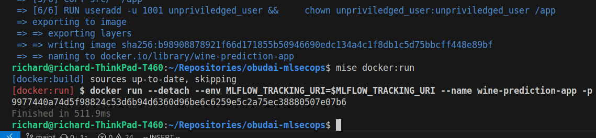
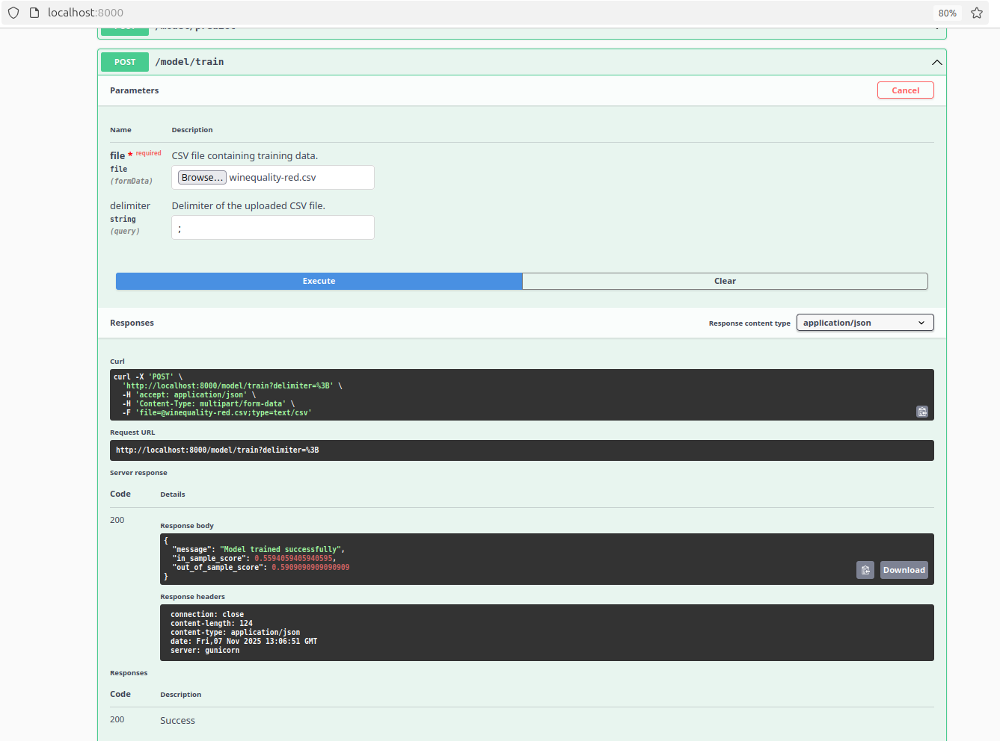

## 6. Hazifeladat Bemutato
Letrehoztam a szukseges Dockerfile-t a repo rootjaban.
A buildeleshez es futtatoshoz letrehoztam a build toolban taskokat.

### Walkthough

Induljunk tiszta lappa: `docker system prune`

Buildeljuk a docker image-unket a "mise docker:build" command-dal.

Futassuk az API-nkat localisan 8000-es porton expozalva a "mise docker:run" paranccsal.

Nyissuk meg a swagger UI-t a `localhost:8000`-en a a bongeszoben, es tanitsuk be a modellunket egy csv file-lal!
