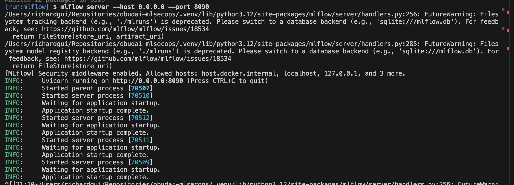
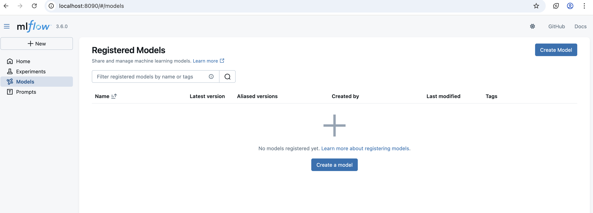
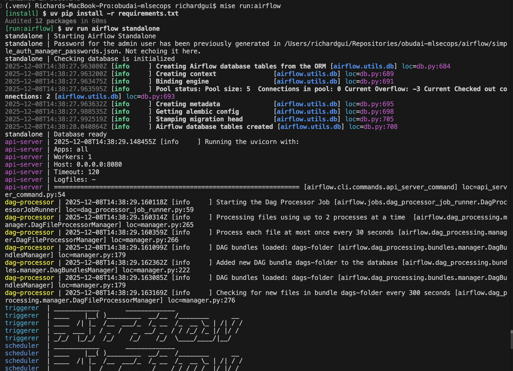
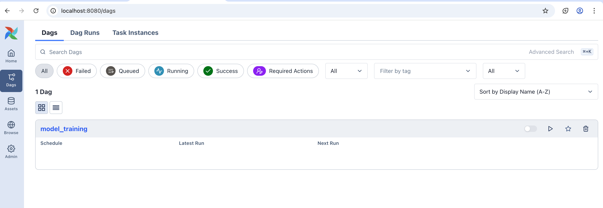
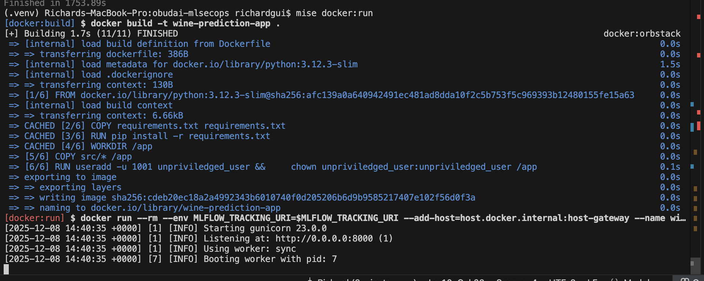
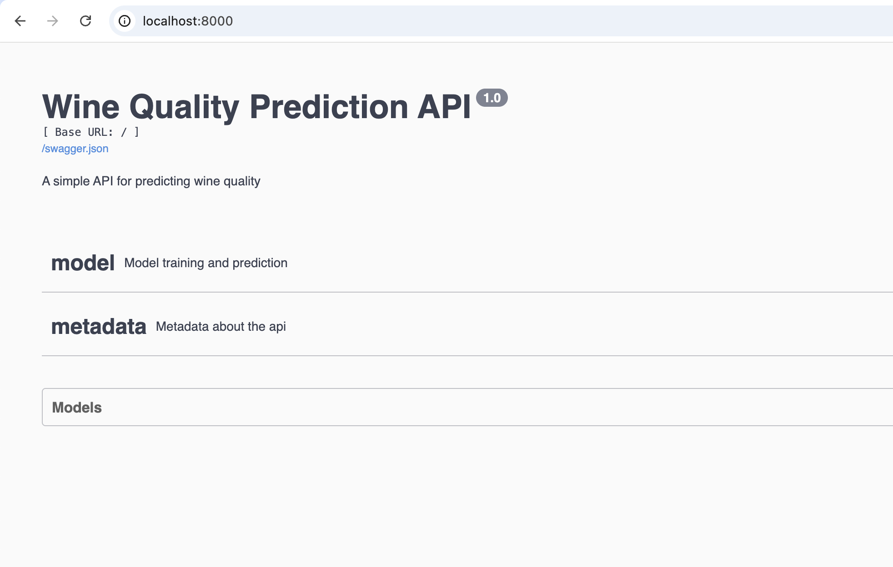
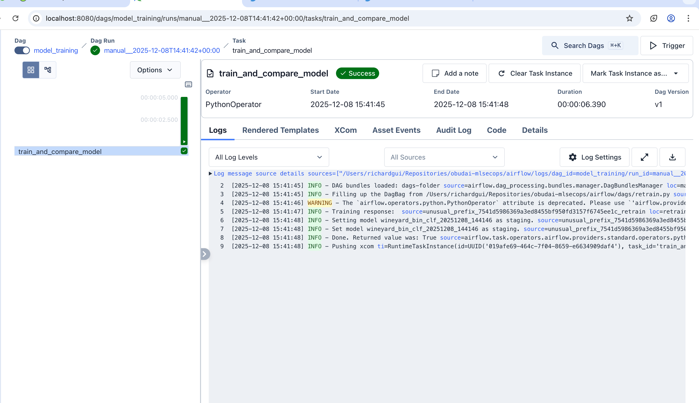
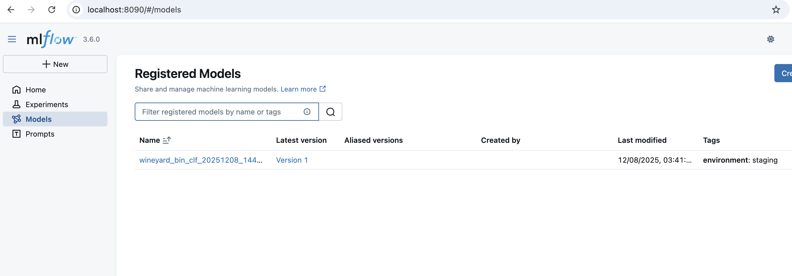
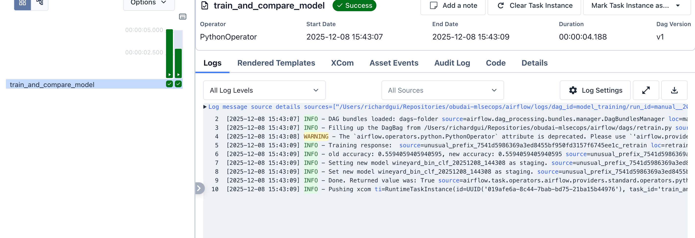
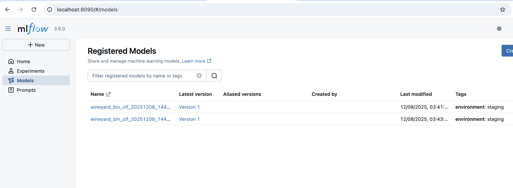

## 7. Hazifeladat Bemutato
Localisan futtathato Airflow-t adtunk hozza a repohoz.
Az Airflowban hozzaadtunk egy DAG-ot, amely a modellunk API-n keresztuli ujratanitasaiert felel.

Amennyiben az uj traning accuracy NAGYOBB VAGY EGYENLO a regihez kepest, akkor az uj modelt stagingnek jeloljuk.
Ezt a kovetkezo Walkthough miatt tesszuk.

### Walkthrough
Futtassuk az MLFlow-t.

Nezzuk meg az MLFlow UI-t.

Futtassuk az Airflow-t.

Nezzuk meg az Airflow UI-t.

Futtasuk az alkalmazasunkat.

Nezzuk meg az appunk swagger UI-jat.

Az Airflowban futtasuk a "retrain" DAG-unkat.

Nezzuk meg az uj staging modelunket MLFlowban.

Az Ariflowban futtasuk ujra a "retrain" DAG-unkat, annak erdekeben, hogy uj staging modelt promotaljunk.

Nezzuk meg az uj, masodik staging modelunket MLFlowban.

