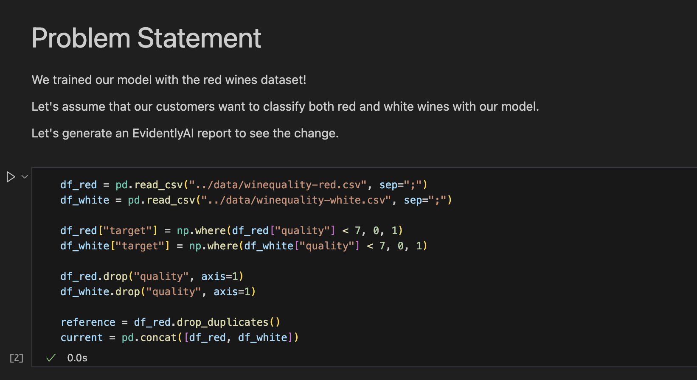
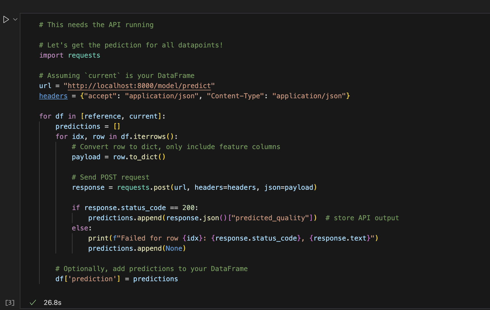
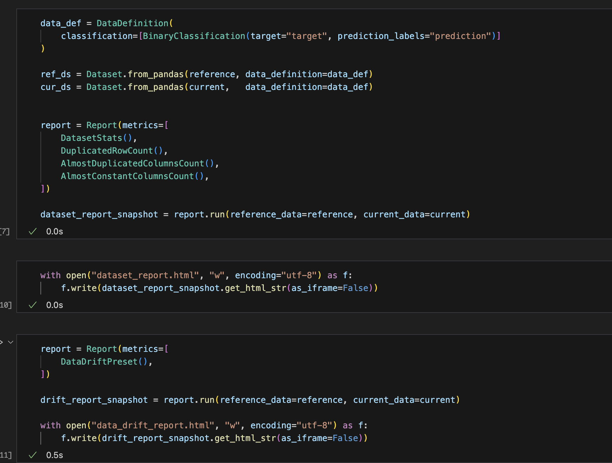
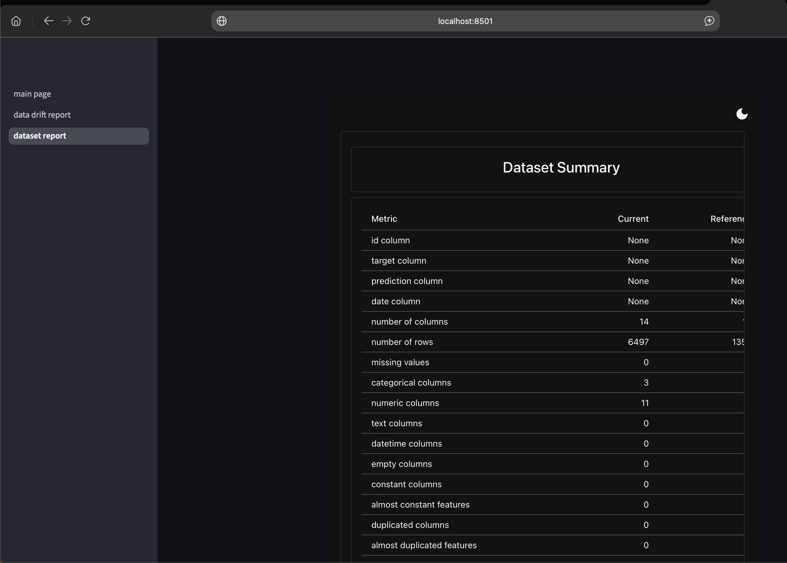
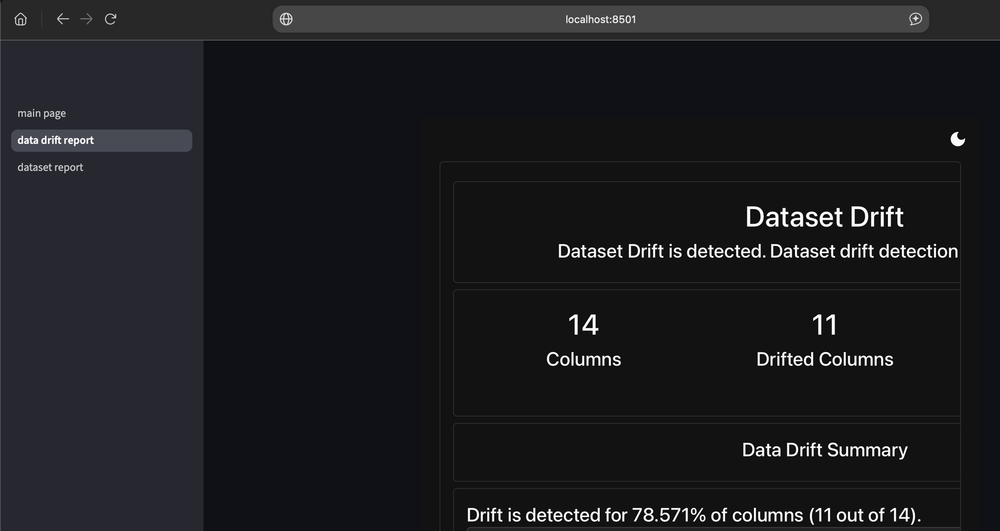

## 8. Hazifeladat Bemutato
A data driftet szeretnenk merni!

Egy jupyter notebook segitsegevel uj es regi borok minoseget josoljuk meg az API-nkkal!
A regi borok a tanito halmazban levo voros boraink deduplikalva.
Az uj halmaz tartalmazza a regi voros es uj feher borokat is. Ez a halmaz nincs deduplikalva!

Ezt kovetoen EvidentlyAI-jal a reportokat kimentjuk es ezeket Streamlittel hostoljuk!

### Walkthrough
#### Jupyter notebookbol torteno inference.

#### A streamlit appban a data set report.
Sajnos a reportokat nem sikerult jo meretben berakni.

Nem akartam iframe-mel szorakozni.

#### A streamlit appban a data shift report.

