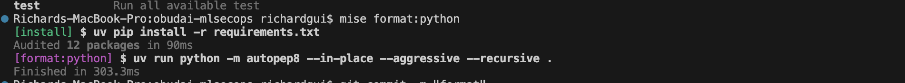
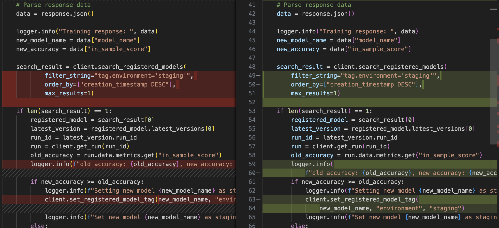
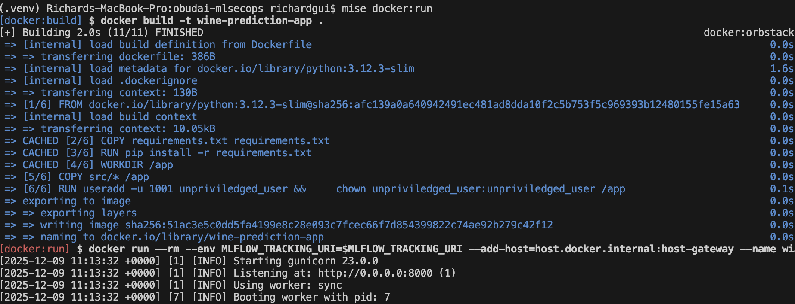
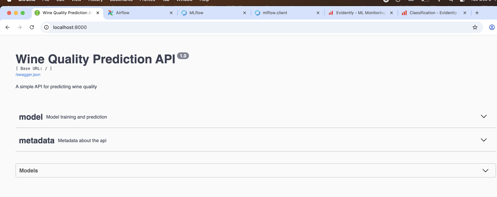
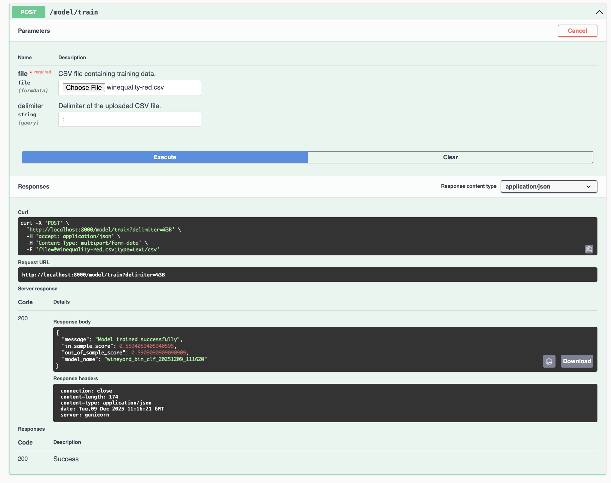
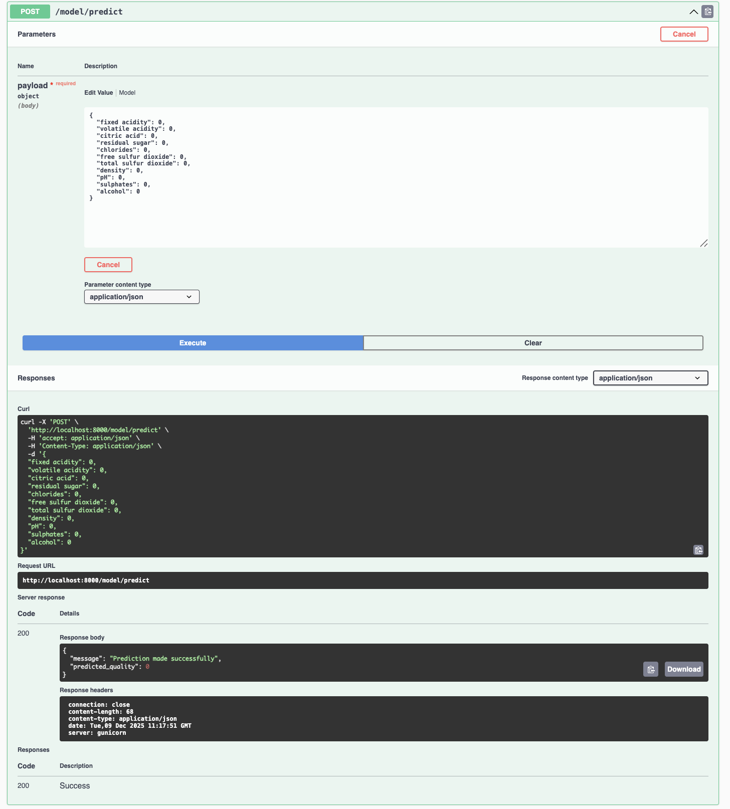
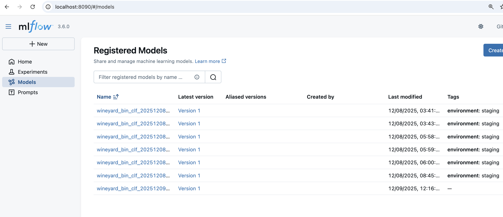
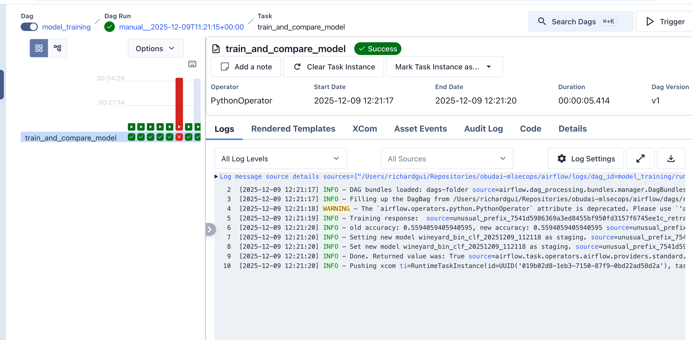
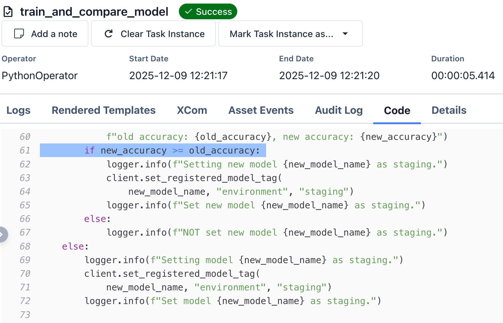
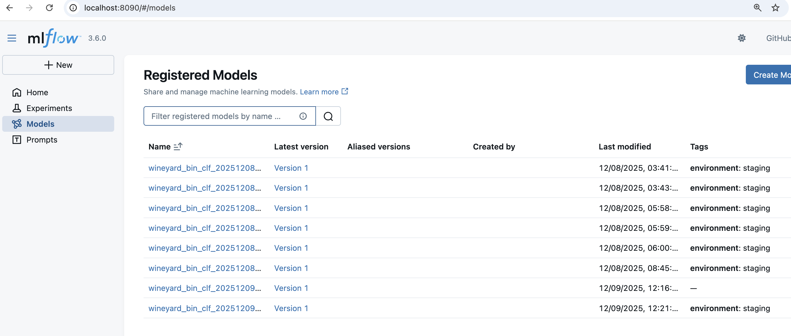

# Nagy Hazifeladat dokumentacio

A hazi feladatomban a kovetkezo funkcionalitasokat ismertetem:
- [a kod **PEP8** formazodik](#formatting)
- [az appunk **docker container**izalhato](#docker)
- [az appunk kepes **predict es train** kereseket kiszolgalni](#endpoints)
- [retrain eseten az uj model mentodik **Mlflow**-ban](#endpoints)
- [az appunk ujra trainelheto **Airflow** segitsegevel](#ariflow)
- [amennyiben az uj tanitasnak jobb az F1 score-ja, az uj model valik a **staging model**le promotalodik Mlflowban](#ariflow)
- [**Streamlittel** hostolva megtekinthetunk egy **EvidentlyAI**-jal generalt **data drift report**ot](#data-drift-report)

[A dokumentacio vegen](#readmemd) ismeretem a repo `README.md` file-janak a tartalmat annak erdekeben, hogy a repo (es vele a munkam is) jobban atlathato legyen jelen dokumentacio alapjan.

## Walkthrough

### Formatting
A `mise format:python` command-ot meghivva az applikacionk PEP8 szabalyok szerint auto formattalodik. 

Ez a kod eseten valahogy igy nez ki:


### Docker
A `mise docker:run` command meghivasaval az applikacionk docker containerkent lebildelodik es elkezd futni.

Az applikacio swagger dokumentacio megtekintheto `localhost:8000`-en.


### Endpoints
A train endpointot meg tudjuk hivni a swagger UI-bol.

A predict endpoint is ugyanugy meghivhato swaggerbol.

Ez az uj betanitott model elmentodott MLFlow-ban is. (Az utolso a listaban.)


### Ariflow
Az appunk trainelheto egy Airflow DAG segitsegevel is!

Az Airflow donti el, hogy az uj model staging allapotba keruljon-e vagy sem.

Ez az uj staging model megjelenik MLFlow-ban is. (A lista legutolso eleme.)


### Data Drift Report
Jupyter notebookbol tortenik inference a drifttel kapcsolatban.


A streamlit appban megjelenik ket report.
Az elso ezek kozul a "Dataset" report.

A masodik pedig a "Data Drift" report.


## `README.md`
Simple API to perform wine quality prediction based on chemical parameters.
The API also provides an interface to retrain it.

We support building a container of our app.

The models are managed by MLFlow.

Retraining of the model can be performed with Airflow.

In order to measure data drift, a streamlit server can host evidentlyAI reports. 


### Commands
We use [mise-en-place](https://mise.jdx.dev/). 
Installation steps can be found [here](https://mise.jdx.dev/installing-mise.html).

To display the available commands, run:
```
mise tasks
```

To run the dev version of the app server:
```
mise docker:run    -- Build and run the application in development mode on port 8000.
mise run:ariflow   -- Run Airflow on localhost:8080 with credentials `admin:admin`.
mise run:mlflow    -- Run Mlflow tracking server on localhost:8090.
mise format:python -- PEP8 formats the sourcecode.
mise test          -- Runs the unittest suite.
```

### Folder Structure

```
├── airflow           -- airflow dags, AIRFLOW_HOME when running ariflow locally
├── data              -- csvs of the dataset
├── Dockerfile
├── docs              -- documentation for the class
├── mise.toml         -- build tool's configfile
├── monitoring        -- streamlit app with notebook to create evidentlyAI report
├── notebooks         -- Notebooks about experimentations
├── README.md
├── requirements.txt  
├── src               -- app's sourcecode
└── tests             -- unit tests
```
